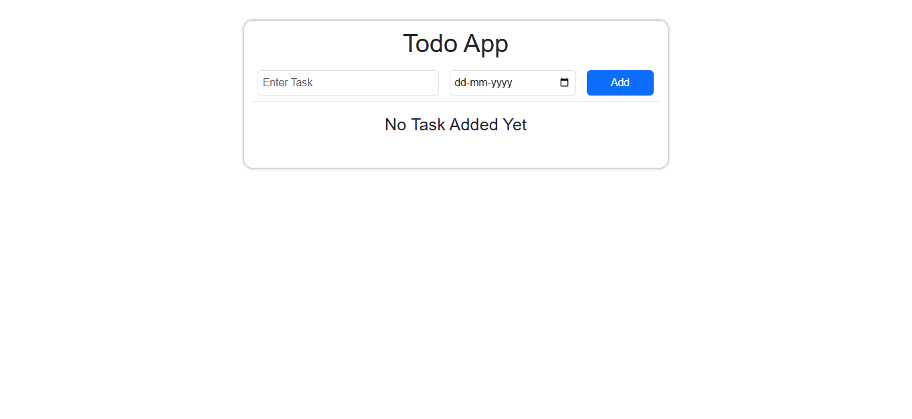

# 📝 React-Todo-App-jsonserver

This is a dynamic To-Do application built using **React.js**, **Vite** and **JSON Server**. It allows users to add, edit, and delete tasks. All task data is stored and managed via a mock REST API using JSON Server.

---

## 🌐 Live Demo

[Click Here To View The Live Project](https://kaustubh-dalvi1001.github.io/React-Todo-App-jsonserver/)

---

## 📸 Screenshot



---

## 🚀 Features

- 📌 Add new tasks.
- 📝 Edit existing tasks directly from the UI.
- ❌ Delete tasks you no longer need.
- 💾 Data persists via a hosted JSON Server (mock API backend deployed on Render)

---

## 🛠 Tech Stack

- **React.js**
- **Vite**
- **HTML5 & CSS3**
- **JavaScript (ES6+)**
- **JSON Server**

---

## 📂 Project Structure
```
React-Todo-App-jsonserver/
│
├── docs/                     # Production-ready build (generated after `npm run build`)
├── Images/                   # Screenshots or image assets used in README
├── node_modules/             # Auto-generated folder containing installed npm packages
├── public/                   # Static files that don't go through the build process (favicon, etc.)
│
├── src/                      # Main application source code
│   ├── assets/               # Static assets like icons, logos, etc. used within the app
│   ├── components/           # Reusable React components (e.g., TaskList, TaskForm)
│   ├── store/                # Global state management using Context API
│   │   └── TodoContext.jsx   # Provides state and dispatch logic for managing todos
│   │
│   ├── App.css               # App-wide styles
│   ├── App.jsx               # Root component that renders the entire application
│   └── main.jsx              # Entry point that renders <App /> to the DOM
│
├── .gitignore                # Specifies which files/folders Git should ignore
├── eslint.config.js          # ESLint configuration for maintaining code quality
├── index.html                # HTML template used by Vite
├── package-lock.json         # Auto-generated file for locking dependency versions
├── package.json              # Project metadata, scripts, and dependencies
├── README.md                 # Project documentation (what you're reading now)
└── vite.config.js            # Vite configuration (base path, plugins, etc.)
```

---

## ⚙️ Installation & Setup

1. Clone the repository  
   `git clone https://github.com/Kaustubh-Dalvi1001/React-Todo-App-jsonserver.git`

2. Install dependencies  
   `npm install`

3. Start the React app  
   `npm run dev`

---

## 🧠 What I Learned

- Managing global state using React Context API
- Performing CRUD operations with JSON Server
- Component-based UI architecture with React
- Organizing project files for scalability

---

## 📌 Author

Made with ❤️ by [Kaustubh Dalvi](https://github.com/Kaustubh-Dalvi1001)

---

## 📬 Connect with Me

- [LinkedIn](https://www.linkedin.com/in/kaustubh-dalvi-0431662a8)  
- [GitHub](https://github.com/Kaustubh-Dalvi1001)  
- 📧 kaustubhdalvi1002@gmail.com

---

## ⭐ Show your support

If you like this project, please consider giving it a ⭐ on [GitHub](https://github.com/Kaustubh-Dalvi1001/React-Todo-App-jsonserver.git)!
